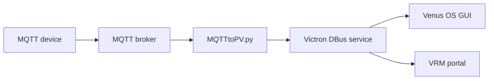

# About this project
Within this repository you will find scripts to add a PV meter, an EV charger, and/or a grid meter to a Victron system. The drivers receive their information via MQTT from an MQTT broker, so different devices can be used as long as you can publish the required values.

The scripts do not talk to Victron hardware protocols directly. Instead, they emulate Victron-compatible DBus services on Venus OS. Victron then shows those services in the UI and in VRM as if they were native devices.

## How It Works
The flow is:

1. Your device publishes MQTT values.
2. `MQTTtoPV.py` subscribes to the configured topics.
3. The script writes those values into Victron DBus using `VeDbusService`.
4. Venus OS reads the DBus service and shows the device in the GUI.

For the PV side, the service name is:

- `com.victronenergy.pvinverter.mqtt_pv_<device_instance>`

For the EV charger side, when enabled, the service name is:

- `com.victronenergy.evcharger.mqtt_evcharger_<device_instance>`

Victron decides what a device is by the DBus service name and the exposed DBus paths. A service under `com.victronenergy.pvinverter.*` with paths such as `/Ac/Power`, `/Ac/L1/Voltage`, `/Ac/Energy/Forward`, `/Position`, and `/StatusCode` is treated as a PV inverter. That is why this script appears as a PV inverter in the Victron GUI even though the actual data comes from MQTT.

In other words, this is DBus emulation, not a physical inverter protocol.



The general idea is to use the Victron-system together with external micro-inverters without a proper communication to Victron as well as a DIY infrared-reader for the Landis and Gyr Grid-meters to create a zero-feed-in system like shown in the next picture:


## Grid-Meter
The grid-meter-script expects only three MQTT-topics to work:

- MQTT_PATH/power
- MQTT_PATH/180
- MQTT_PATH/280

The power has to be submitted in "Watt" and the two energies in "Watt-hours". The power is then distributed over all three phases automatically. If your grid-meter supports individual phase-powers, you might use the three topics MQTT_PATH/p_l1 to .../p_l3.

## PV-Meter
The PV meter is meant for an inverter or meter that can publish MQTT directly. The script expects these topics below the configured PV root topic:

- MQTT_PATH/power
- MQTT_PATH/voltage
- MQTT_PATH/current
- MQTT_PATH/frequency
- MQTT_PATH/energy_180
- MQTT_PATH/energy_280

All parameters are in their basic units:

- power in Watt
- voltage in Volt
- current in Ampere
- frequency in Hz
- energy values in Watt-hours

The PV side inverts the sign of `power` and `current` before publishing to DBus. This is intentional so that generation/injection is represented correctly in the Victron UI.

How the PV driver maps MQTT to Victron DBus:

- `power` -> `/Ac/Power` and `/Ac/L1/Power`
- `current` -> `/Ac/Current` and `/Ac/L1/Current`
- `voltage` -> `/Ac/Voltage` and `/Ac/L1/Voltage`
- `frequency` -> `/Ac/L1/Frequency`
- `energy_280` -> `/Ac/Energy/Forward` and `/Ac/L1/Energy/Forward`
- `energy_180` is accepted by the script but not currently published to DBus
- `position` in `config.ini` -> `/Position`
- `max` in `config.ini` -> `/Ac/MaxPower`

If you only provide power, the script estimates current from the configured nominal voltage.

## MQTT To DBus Mapping

### PV Meter

| MQTT topic | DBus path | Notes |
| --- | --- | --- |
| `MQTT_PATH/power` | `/Ac/Power` | Value is inverted before publishing, so generated power becomes positive in Victron |
| `MQTT_PATH/power` | `/Ac/L1/Power` | Same value as `/Ac/Power` |
| `MQTT_PATH/current` | `/Ac/Current` | Value is inverted before publishing |
| `MQTT_PATH/current` | `/Ac/L1/Current` | Same value as `/Ac/Current` |
| `MQTT_PATH/voltage` | `/Ac/Voltage` | Published as received |
| `MQTT_PATH/voltage` | `/Ac/L1/Voltage` | Same value as `/Ac/Voltage` |
| `MQTT_PATH/frequency` | `/Ac/L1/Frequency` | Published as received |
| `MQTT_PATH/energy_280` | `/Ac/Energy/Forward` | Energy in Watt-hours, converted to kWh |
| `MQTT_PATH/energy_280` | `/Ac/L1/Energy/Forward` | Same value as `/Ac/Energy/Forward` |
| `config.ini: PV.max` | `/Ac/MaxPower` | Static configured max power |
| `config.ini: PV.position` | `/Position` | 0 = AC input 1, 1 = AC output, 2 = AC input 2 |
| internal status logic | `/StatusCode` | 7 when running, 8 when standby |

Notes:

- `energy_180` is accepted by the parser but is not currently written to DBus.
- If `current` is missing, the driver estimates it from `power / voltage`.

### EV Charger

| MQTT topic | DBus path | Notes |
| --- | --- | --- |
| `topic/power` | `/Ac/Power` | Total charging power |
| `topic/power` | `/Ac/L1/Power` | Same value as total power if phase data is not provided |
| `topic/l1/power` | `/Ac/L1/Power` | Per-phase L1 power |
| `topic/l2/power` | `/Ac/L2/Power` | Per-phase L2 power |
| `topic/l3/power` | `/Ac/L3/Power` | Per-phase L3 power |
| `topic/current` | `/Current` | Actual charging current |
| `topic/current` | `/Ac/L1/Current` | Same value as `/Current` |
| `topic/maxcurrent` | `/MaxCurrent` | Maximum allowed current |
| `topic/setcurrent` | `/SetCurrent` | Requested current setpoint |
| `topic/autostart` | `/AutoStart` | 0 or 1 |
| `topic/enabledisplay` | `/EnableDisplay` | 0 or 1 |
| `topic/mode` | `/Mode` | 0 manual, 1 automatic, 2 scheduled |
| `topic/startstop` | `/StartStop` | 0 or 1 |
| `topic/status` | `/Status` | EV charger status code |
| `topic/chargingtime` | `/ChargingTime` | Session charging time in seconds |
| `topic/session/time` | `/Session/Time` | Session time in seconds |
| `topic/session/energy` | `/Session/Energy` | Session energy in kWh |
| `topic/session/cost` | `/Session/Cost` | Session cost |
| `topic/connected` | `/Connected` | 0 or 1 |
| `topic/ac/energy/forward` | `/Ac/Energy/Forward` | Charging energy in kWh |
| JSON `Ac.Power` | `/Ac/Power` | Same as `topic/power` |
| JSON `Ac.L1.Power` | `/Ac/L1/Power` | Same as `topic/l1/power` |
| JSON `Ac.L2.Power` | `/Ac/L2/Power` | Same as `topic/l2/power` |
| JSON `Ac.L3.Power` | `/Ac/L3/Power` | Same as `topic/l3/power` |
| JSON `Ac.Energy.Forward` | `/Ac/Energy/Forward` | Same as `topic/ac/energy/forward` |
| JSON `Current` | `/Current` | Same as `topic/current` |
| JSON `MaxCurrent` | `/MaxCurrent` | Same as `topic/maxcurrent` |
| JSON `SetCurrent` | `/SetCurrent` | Same as `topic/setcurrent` |
| JSON `AutoStart` | `/AutoStart` | Same as `topic/autostart` |
| JSON `EnableDisplay` | `/EnableDisplay` | Same as `topic/enabledisplay` |
| JSON `Mode` | `/Mode` | Same as `topic/mode` |
| JSON `StartStop` | `/StartStop` | Same as `topic/startstop` |
| JSON `Status` | `/Status` | Same as `topic/status` |
| JSON `ChargingTime` | `/ChargingTime` | Same as `topic/chargingtime` |
| JSON `Session.Time` | `/Session/Time` | Same as `topic/session/time` |
| JSON `Session.Energy` | `/Session/Energy` | Same as `topic/session/energy` |
| JSON `Session.Cost` | `/Session/Cost` | Same as `topic/session/cost` |
| JSON `Connected` | `/Connected` | Same as `topic/connected` |

## Example MQTT Setup
Example configuration:

- PV root topic: `power/pvmeter`
- EV root topic: `power/evcharger`

Example PV messages:

- `power/pvmeter/power = 1800`
- `power/pvmeter/voltage = 231`
- `power/pvmeter/current = 7.8`
- `power/pvmeter/frequency = 50`
- `power/pvmeter/energy_180 = 123450`
- `power/pvmeter/energy_280 = 678900`

Example EV charger messages:

- `power/evcharger/power = 2200`
- `power/evcharger/current = 9.6`
- `power/evcharger/maxcurrent = 16`
- `power/evcharger/setcurrent = 10`
- `power/evcharger/status = 2`
- `power/evcharger/session/energy = 7.4`

The EV charger section is disabled by default. Set `enabled = true` in `[EVCHARGER]` to activate it.

## Concrete Examples

### PV inverter MQTT examples

```text
power/pvmeter/power = 1850
power/pvmeter/voltage = 231
power/pvmeter/current = 8.0
power/pvmeter/frequency = 50
power/pvmeter/energy_180 = 124200
power/pvmeter/energy_280 = 681500
```

If your device publishes JSON instead:

```json
{
  "power": 1850,
  "voltage": 231,
  "current": 8.0,
  "frequency": 50,
  "energy_180": 124200,
  "energy_280": 681500
}
```

### EV charger MQTT examples

```text
power/evcharger/power = 3200
power/evcharger/current = 14.0
power/evcharger/maxcurrent = 16
power/evcharger/setcurrent = 16
power/evcharger/status = 2
power/evcharger/autostart = 1
power/evcharger/enabledisplay = 1
power/evcharger/mode = 1
power/evcharger/startstop = 1
power/evcharger/session/time = 5400
power/evcharger/session/energy = 9.4
power/evcharger/session/cost = 2.3
power/evcharger/connected = 1
```

If your EV charger publishes JSON instead:

```json
{
  "Ac": {
    "Power": 3200,
    "L1": {
      "Power": 3200
    },
    "Energy": {
      "Forward": 9.4
    }
  },
  "Current": 14.0,
  "MaxCurrent": 16,
  "SetCurrent": 16,
  "AutoStart": 1,
  "EnableDisplay": 1,
  "Mode": 1,
  "StartStop": 1,
  "Status": 2,
  "ChargingTime": 5400,
  "Session": {
    "Time": 5400,
    "Energy": 9.4,
    "Cost": 2.3
  },
  "Connected": 1
}
```

## Example of the Victron GUI
Here is an example, how this could look like:


## Installation
Short instruction to install this script as a service:
1. Copy all files to /data/pvmeter on the VenusOS (CerboGX or RaspberryPi)

2. set permissions
chmod 755 /data/pvmeter/service/run
chmod 744 /data/pvmeter/kill_me.sh

3. install / uninstall service
bash -x /data/pvmeter/install.sh
bash -x /data/pvmeter/uninstall.sh

4. check status
svstat /service/pvmeter

5. in case of errors debug:
python /data/pvmeter/MQTTtoPV.py

If paho-mqtt is not installed, use this to install the dependencies:
python -m ensurepip --upgrade
pip install paho-mqtt

## Some credits
Parts of this code are based on the work of Ralf Zimmermann (mail@ralfzimmermann.de) in 2020.
The orginal code and its documentation can be found on: https://github.com/RalfZim/venus.dbus-fronius-smartmeter
Used https://github.com/victronenergy/velib_python/blob/master/dbusdummyservice.py as basis for this service.
